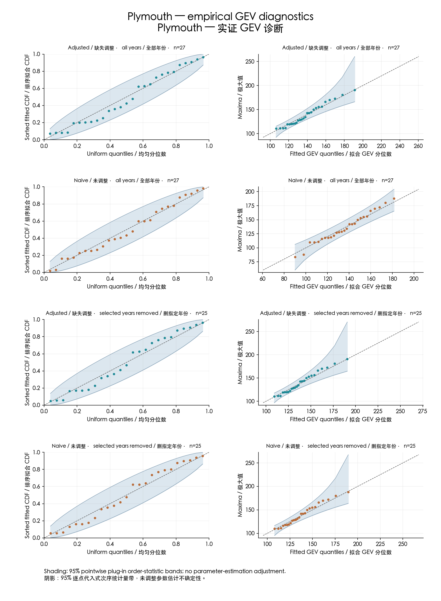
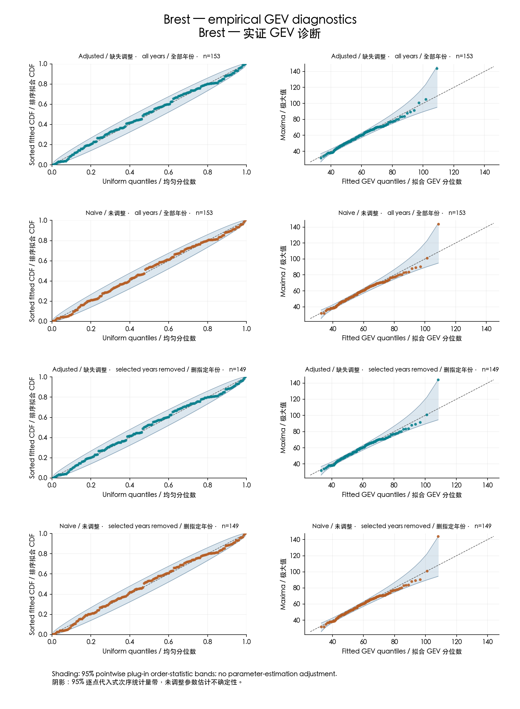

# Independent computational replication of two block-maxima applications with missing observations

Felix Han — Independent researcher. Correspondence: canglangzhuoxi@gmail.com.

## Abstract

We independently implemented the Plymouth ozone and Brest sea-surge applications of Simpson and Northrop (2026). Missingness adjustment changes the fitted 100-year return level more in Plymouth than in Brest: with all available years, adjusted versus naive estimates are 215.48 versus 192.21 μg/m³ and 104.49 versus 104.20 cm, respectively. Our primary calculations meet the frozen printed-value tolerances for 113 of 120 scalar comparisons, including all 48 published interval endpoints. Seven other values narrowly exceed those tolerances; a separate fixed reference-optimizer calculation explains their sensitivity to stopping behavior without replacing the primary results. This is a partial empirical replication, not a new method or a replication of the original simulation study.

## Data and scope

The target is Simpson, E. S., and Northrop, P. J. (2026), [Accounting for Missing Data When Modelling Block Maxima](https://doi.org/10.1002/env.70075), Environmetrics 37(2), e70075. The implementation used the paper and inspected author-package source. It is independently written with source exposure, not a clean-room reconstruction or authenticated reproduction of the authors' exact runtime. The final published empirical tables supply the comparison targets.

Plymouth uses 9,862 daily rows from 1998–2024, distributed in evmissing 1.0.2 and attributed to DEFRA UK-AIR, Plymouth Centre. Ozone maxima and return levels have units μg/m³. Aggregation produces 27 annual blocks; the reduced analysis excludes 2001 and 2006, leaving 25. Brest uses Renext 3.1-4's processed surge events and missing intervals, attributed to SHOM observations/predictions and IRSN declustering and trend correction. Annual inputs cover 1846–2007; nine entirely missing years are omitted, leaving 153 finite maxima. Excluding 1857, 1859, 1944 and 1952 leaves 149. Surge maxima and return levels have units cm. We reproduce aggregation of distributed processed inputs, not the original tide-gauge preprocessing or instrument validation.

## Method and comparison rules

Let G be the full-block GEV distribution and p_i the observed fraction of block i. The adjusted CDF is G(x)^p_i and its density is p_i G(x)^(p_i−1) g(x); the naive model sets p_i=1. Each application crosses adjustment on/off with the specified year exclusions. This model's motivating assumptions are independent, identically distributed underlying observations and non-informative missingness: missingness does not preferentially remove different-valued observations. Our replication does not test those assumptions in either environmental record. Serial dependence or value-dependent loss can undermine the adjustment; numerical agreement does not establish real-world model validity.

We report local likelihood fits, observed-information standard errors and 95% profile-likelihood intervals for 25-, 50- and 100-year return levels. A 100-year return level is a model quantile with annual exceedance probability 0.01, not a prediction of an event exactly once every century. The likelihood cutoff uses half the 0.95 quantile of chi-square with one degree of freedom. Full computational settings and receipt links are in the [numerical supplement](numerical-supplement.md).

The frozen absolute comparison tolerances are 0.0051 for parameters and standard errors in both applications; 0.51 for Plymouth return levels and interval endpoints; and 0.051 for Brest return levels and endpoints. These comprise half a printed unit plus numerical allowances of 0.0001, 0.01 and 0.001 respectively. They measure agreement with printed numbers, not scientific equivalence, accuracy against truth or publication quality. No failed comparison was relabelled after reference calculations.

## Results

Table 1. Fitted 100-year return levels in the four data/adjustment comparisons.

| Application and years| Adjusted 100-year level| Naive 100-year level| Adjusted − naive|
|---|---:|---:|---:|
| Plymouth, all 27| 215.4783 | 192.2110 | 23.2673 |
| Plymouth, reduced 25| 219.0530 | 217.4377 | 1.6153 |
| Brest, all 153 finite| 104.4910 | 104.2019 | 0.2891 |
| Brest, reduced 149| 104.0877 | 103.9197 | 0.1680 |

In these saved fits, Plymouth's all-year adjusted estimate is about 12.1% above its naive estimate; Brest's is about 0.28% higher. Plymouth's contrast becomes much smaller after the specified exclusions. This reproduces an application-dependent effect of the published adjustment; it is neither a new discovery nor evidence that adjustment always increases estimated risk by the same amount.

Uncertainty is substantial, especially for Plymouth. Its all-year adjusted 100-year profile interval is [180.84, 370.05] μg/m³ versus [178.70, 255.44] for the naive fit; the reduced adjusted interval widens to [180.22, 668.47]. Brest's all-year adjusted and naive intervals are [96.25, 120.06] and [96.17, 119.27] cm. These fitted intervals overlap and are not confidence intervals for the adjusted-minus-naive contrast. We make no significance claim for that contrast or claim about interval coverage.

Primary printed-value agreement is 55/60 for Plymouth and 58/60 for Brest. The seven exceptions are small tolerance exceedances, not automatically paper errors. For example, Plymouth's all-year adjusted 100-year estimate is 215.478294 against printed 216 (absolute difference 0.521706, limit 0.51); the fixed R 4.4.2 nmmin reference yields 215.510400. The reduced adjusted Brest scale is 11.924809 against 11.93 (difference 0.005191, limit 0.0051); its reference value is 11.925931. All seven primary/reference pairs are tabulated in the supplement. This demonstrates a sufficient optimizer-stopping explanation for crossing printed-value boundaries, not proof of the authors' historical computation. All 48 printed profile endpoints meet their original tolerances.

Supplementary Tables S2 and S3 give the full results; Table S1 quantifies the seven discrepancies. Figures 1 and 2 show the diagnostics. The [complete comparison appendix](comparison-appendix.md) preserves every original flag. Probability and quantile diagnostics below use pointwise beta order-statistic bands with fitted parameters plugged in. The bands are neither simultaneous nor adjusted for parameter estimation; plotted agreement is not a formal validation of the model. Adjusted QQ maxima are transformed to the fitted full-block scale. Exact equivalence to the authors' figure-generation workflow is not established.

## Reproducibility and limitations

The frozen upstream-retrieval candidate passed its first uninterrupted local acceptance check in 30.14 seconds, covering archive retrieval and hash verification, source aggregation, fitting, endpoint auditing and plotting. All 120 scalar comparison flags, including standard errors, were preserved: 113 passes and seven discrepancies. All 48 printed interval endpoints and 96 independent solver checks passed. The [reader instructions](reproducibility-guide.md) and [acceptance receipt](../evidence/acceptance.json) identify the exact workflow and evidence. Existing dependency installations were used; this does not establish fresh-install or second-machine portability. Earlier stopped and staged receipts remain historical evidence.

The contribution is empirical computational replication. It excludes the original simulation-performance study, new statistical methodology, validation of informative missingness or dependence, and raw Brest gauge processing. The small development calibration is described only in the supplement and supports no simulation-performance claim. Numerical agreement with two applications does not establish general statistical performance or independent scientific novelty.

OpenAI Codex was used for implementation, analysis and drafting; the author takes responsibility for the submitted work.

NumPy/SciPy performed numerical calculations; Matplotlib produced the diagnostic graphics. These tools do not supply independent scientific validation. Public data-release arrangements are recorded separately.

## References

1. Simpson, E. S., and Northrop, P. J. (2026). Accounting for Missing Data When Modelling Block Maxima. Environmetrics 37(2), e70075. [DOI: 10.1002/env.70075](https://doi.org/10.1002/env.70075).

2. Northrop, P. J., and Simpson, E. S. evmissing, version 1.0.2. [Versioned source archive](https://cran.r-project.org/src/contrib/evmissing_1.0.2.tar.gz). [Archived authorship and licence declaration](../notices/evmissing-1.0.2-DESCRIPTION.txt).

3. Deville, Y., and Bardet, L. Renext, version 3.1-4. [Versioned source archive](https://cran.r-project.org/src/contrib/Archive/Renext/Renext_3.1-4.tar.gz). [Archived declaration](../notices/Renext-3.1-4-DESCRIPTION.txt).

4. DEFRA and the Devolved Governments. UK-AIR: Plymouth Centre ozone observations, distributed through evmissing 1.0.2. [UK-AIR attribution and reuse terms](https://uk-air.defra.gov.uk/about-these-pages).

5. R Core Team. R 4.4.2, optim.c (nmmin reference implementation). [Retained source and original notices](../reference/R-4-4-2-optim.c). The reference calculation used platform shims and an independent density, not the full R package runtime.

